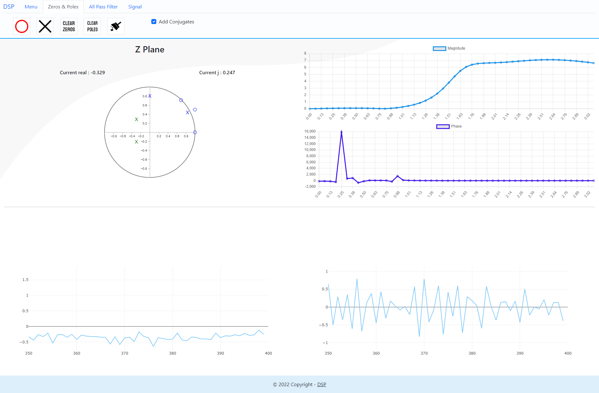

# Digital Filter Design

**A website that helps users to design a custom digital filter via zeros-poles placement on the z-plane.**

## Features

- The user can design filter on z-plane via zeros-poles placemnt & All pass filter.

- The user can choose all pass filter & add one by himself, & see the phase response of this all pass and use it.

- The user can see magnitude & phase response.

- The user can open a signal and apply the filter on it.

## Dependincies

- **python 3.10**

**Used packege:**

```
numpy
flask
scipy
flask_cors
```

***to install***: `pip install [python-library]`

## How To Run
- Run the server: `py ./server/index.py`
- Run the index.html

## Preivew



----
